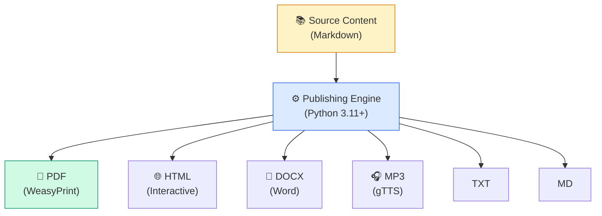

# 🧠 Active Inference Institute — Courses

[](software/docs/COURSE_CATALOG.md)
[](software/docs/MODULES.md)
[](software/docs/QUICKSTART.md)
[](software/docs/TESTING.md)
[](#license)

> **Minimize surprise. Maximize evidence.**

Welcome to the open-source curriculum infrastructure for **Active Inference education**. This repository hosts **14 complete courses** spanning Kindergarten to PhD (plus a YouTube transcript archive — 19 total entries in `COURSE_REGISTRY`), powered by a modular **Python publishing engine**.

Maintained by **Dr. Daniel Ari Friedman** ([@docxology](https://github.com/docxology)) at the [Active Inference Institute](https://activeinference.institute).

---

## 📚 Curriculum Portfolio

All courses share a unified **8-topic spine** grounded in the Free Energy Principle, revisited at increasing levels of mathematical and conceptual formalism.

| **Topic Spine** | Systems → Agents → Perception → Cognition → Action → Learning → Communication → Planning |
| :--- | :--- |

### 🎓 Level-Adapted Tracks

| Course | Audience | Focus |
| :--- | :--- | :--- |
| **[Elementary](course_development/active_inference_es)** | Grades K-5 | Stories, play, and drawing |
| **[Family](course_development/active_inference_family)** | Verified Families | Parent-child co-learning activities |
| **[Middle School](course_development/active_inference_ms)** | Grades 6-8 | Scratch programming & logic |
| **[High School](course_development/active_inference_hs)** | Grades 9-12 | Python basics & guided labs |
| **[College 101](course_development/active_inference_101)** | Undergraduates | Full notation & standard simulations |
| **[Advanced 401](course_development/active_inference_401)** | Graduate/PhD | Research seminars & formal proofs |

### 🔬 Disciplinary Core (`active_inference/`)

| Track | Focus | Lab Style |
| :--- | :--- | :--- |
| **Philosophy** | Argumentation & Ontology | Thought Experiments |
| **Cognitive Science** | Neuroscience & Psychology | Case Studies |
| **Mathematics** | Formal Derivations | Proofs & Exercises |
| **Computer Science** | Implementation & Algorithms | Python `active_inference` Lib |

### 🌐 Domain Applications

- **[Embodied Cognition](course_development/domains/active_inference_embodied)** (Somatic practice)
- **[Organizations](course_development/domains/active_inference_organizations)** (BioFirm framework)
- **[Robotics](course_development/domains/active_inference_robotics)** (ROS2 & Hardware)
- **[Crochet](course_development/domains/active_inference_crochet)** (Fiber arts & morphological computation)
- **[Inventions](course_development/domains/active_inference_inventions)** (Creative engineering)
- **[Metallurgy](course_development/domains/active_inference_metallurgy)** (Materials science)
- **[Comedy](course_development/domains/active_inference_comedy)** (Comedic structures & timing)

---

## ⚡ Quick Start

### 1. Prerequisites

- **Python 3.11+**
- **[uv](https://docs.astral.sh/uv/)** (recommended)

### 2. Setup

```bash
git clone https://github.com/ActiveInferenceInstitute/courses.git
cd courses/software
uv sync
```

### 3. Render a Course

```bash
# Render the Philosophy track to Text and Markdown
uv run python scripts/generate_all_outputs.py --course ai-philosophy --formats txt,md

# Preview the full publishing pipeline
uv run python ../publish.py --dry-run
```

See the **[Quick Start Guide](software/docs/QUICKSTART.md)** for full details.

---

## 📐 Architecture & Software

This repository is powered by a custom **Python rendering engine** (`software/`) that orchestrates the transformation of Markdown source files into 6 output formats.



- **[Architecture Guide](software/docs/ARCHITECTURE.md)**: Deep dive into the 5-layer system design.
- **[CLI Reference](software/docs/CLI_REFERENCE.md)**: Documentation for all 22 CLI scripts.
- **[Module API](software/docs/MODULES.md)**: Reference for the Python source modules.

### 🤖 Agent-Friendly Codebase

We maintain `AGENTS.md` files at **every directory level** to provide context-aware guidelines for AI agents.

- **[Repository Guidelines](software/docs/AGENTS.md)**
- **Real Methods Only**: We strictly enforce a "no mocks" policy in testing.

---

## 🎬 YouTube Archive

We maintain a structured archive of **~821 video transcripts** (38 playlists) from the Active Inference Institute's YouTube channel, organized into playlists including:

- **Livestreams & Paper Discussions** (171 videos)
- **GuestStreams** (142 videos)
- **Textbook Cohorts** (Parr et al. 2022)
- **Applied Active Inference Symposia**

See **[YouTube Documentation](software/docs/YOUTUBE.md)** for the transcription and translation pipelines.

---

## 🤝 Contributing

We welcome contributions to both the curriculum and the software engine!

1. Read **[CONTRIBUTING.md](software/docs/CONTRIBUTING.md)**.
2. Ensure you have `uv` installed.
3. Follow the **[Content Authoring](software/docs/CONTENT_AUTHORING.md)** guidelines.

### Testing

We maintain a robust suite of **1,014 tests** ensuring curriculum integrity and software stability (the CI gate excludes internet / external-API / whisper-required tests; ~995 pass in CI on each Python version, ~75% source coverage).

```bash
cd software
uv run pytest tests/
```

---

## 📜 License

This work is licensed under **[CC BY 4.0](https://creativecommons.org/licenses/by/4.0/)**.
© 2026 Active Inference Institute.

---
*Generated by the Active Inference Institute Publishing Pipeline. Last updated: 2026-03-03.*
