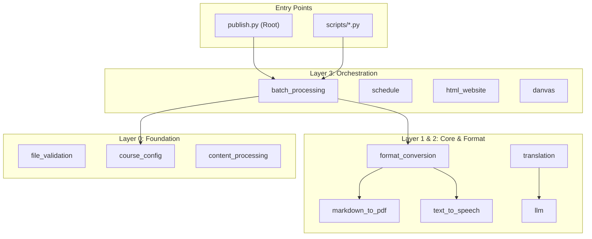
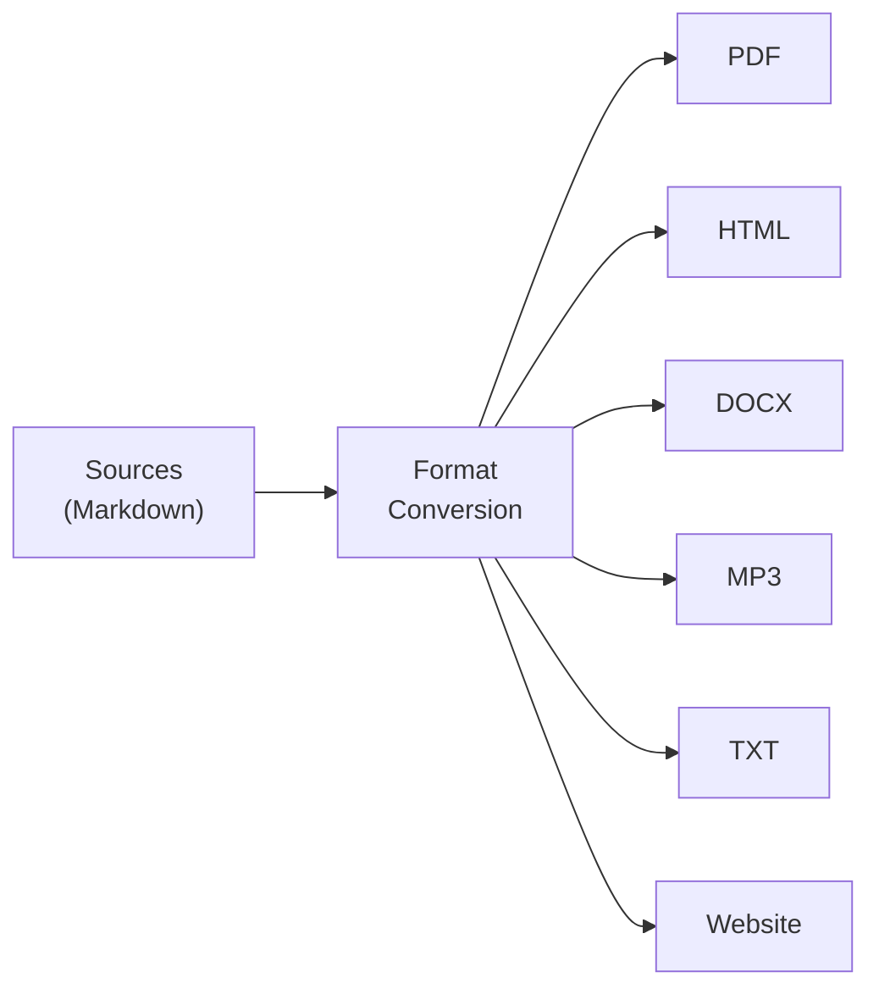

# 🏗️ System Architecture

> **Navigation**: [← Docs Index](README.md) | [Modules](MODULES.md) | [Orchestration](ORCHESTRATION.md) | [Configuration](CONFIGURATION.md)

The Active Inference Institute course rendering pipeline is a modular Python system that transforms Markdown source files into multiple output formats.

---

## 📐 Design Principles

1. **Modular Isolation**: Each module is self-contained with `main.py` (public API), `utils.py` (internals), and `config.py` (constants).
2. **Registry-Driven**: `COURSE_REGISTRY` describes every course's structure; no hardcoded paths.
3. **Layered Dependencies**: Core → Format → Orchestration → Pipeline.
4. **Real Methods Only**: No mocks; all tests use real implementations.
5. **uv-First**: All commands use `uv run` for reproducible environments.

---

## 🏛️ High-Level Structure



---

## 🧩 Module Layers

The 21 modules in `src/` are organized into 5 strict reliability layers:

| Layer | Role | Examples | Dependencies |
| :--- | :--- | :--- | :--- |
| **L0** | **Foundation** | `course_config`, `file_validation` | Zero internal dependencies |
| **L1** | **Core** | `markdown_to_pdf`, `text_to_speech` | External libs only (WeasyPrint, gTTS) |
| **L2** | **Format** | `format_conversion`, `translation` | Depends on L1 |
| **L3** | **Orchestration** | `batch_processing`, `html_website` | Orchestrates L1+L2 |
| **L4** | **Pipeline** | `publish`, `validation`, `canvas_integration` | Full system integration |

See **[MODULES.md](MODULES.md)** for the API reference of each module.

---

## 🗂️ Data Flow

### The Rendering Pipeline



### Content Type Mapping

| Source File | Output Subdirectory | Formats |
| :--- | :--- | :--- |
| `module.md` | `lecture-content/` | PDF, HTML, DOCX, TXT, MP3, MD |
| `questions.md` | `study-guides/` | PDF, HTML, DOCX, TXT, MP3, MD |
| `practice_quiz.md` | `study-guides/` | PDF, HTML, DOCX, TXT, MP3, MD |
| `lab.md` | `lab-protocols/` | PDF, HTML, DOCX, TXT, MP3, MD |

---

## 🗄️ Directory Layout

```
courses/
├── course_development/        # Source Content
│   ├── active_inference/      # Core Course
│   ├── active_inference_101/  # College Track
│   └── ...
│
├── published/                 # Generated Outputs
│   ├── active-inference/
│   ├── ai-101/
│   └── ...
│
├── software/                  # The Engine
│   ├── src/                   # Python Modules (21)
│   ├── scripts/               # CLI Tools (23)
│   ├── tests/                 # pytest Suite (65+)
│   └── docs/                  # Documentation
│
├── publish.py                 # Main Entry Point
└── publish.toml               # Main Configuration
```

---

## 🛠️ Tooling Stack

| Tool | Purpose | Configuration |
| :--- | :--- | :--- |
| **uv** | Package Manager | `pyproject.toml`, `uv.lock` |
| **pytest** | Testing | `pyproject.toml` |
| **WeasyPrint** | PDF Engine | System libraries (Cairo/Pango) |
| **gTTS** | Text-to-Speech | Google Translate API |
| **Ruff** | Linter | `pyproject.toml` |
| **Black** | Formatter | `pyproject.toml` |

---
*Last Updated: 2026-02-14*
