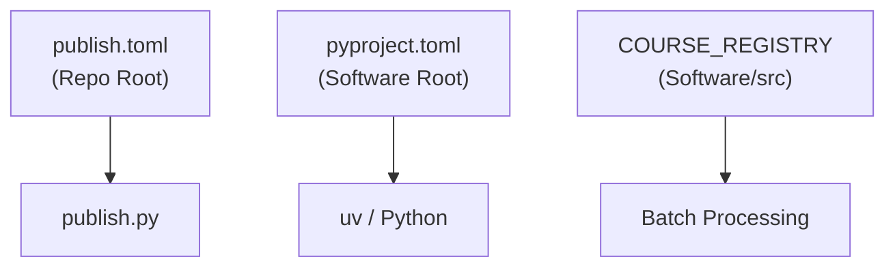

# ⚙️ Configuration Reference

> **Navigation**: [← Docs Index](README.md) | [Architecture](ARCHITECTURE.md) | [CLI Reference](CLI_REFERENCE.md)

This guide covers the configuration hierarchy for the publishing pipeline.

---

## 🏗️ Hierarchy



---

## `publish.toml` — Pipeline Control

**Location**: `courses/publish.toml`

Controls which courses are built and which formats are enabled.

```toml
[general]
output_dir = "published"
clean_before_publish = true

[formats]
pdf = true          # Requires WeasyPrint
docx = true
html = true
txt = true
md = true
mp3 = false         # Disabled by default (slow)

[courses]
active-inference = true     # The Core Course
ai-101 = true               # College Track
# ... disable others to save time

[options]
generate_website = true
generate_dashboards = true
skip_labs = false
verbose = false
```

### Overrides via CLI

You can override any setting on the command line:

```bash
python publish.py --override-formats txt,md
python publish.py --course ai-philosophy
python publish.py --no-website
```

---

## `pyproject.toml` — Dependencies

**Location**: `software/pyproject.toml`

Managed by `uv`. Defines the Python environment.

```toml
[project]
name = "aii-courses"
requires-python = ">=3.11"

[project.dependencies]
weasyprint = ">=60.0"   # PDF engine
gtts = ">=2.5.0"        # Text-to-Speech
markdown = ">=3.5.0"    # Markdown processing
```

**Usage**:

```bash
uv sync                 # Install dependencies
uv add <package>        # Add new package
uv run <command>        # Run in environment
```

---

## `COURSE_REGISTRY` — Metadata

**Location**: `software/src/batch_processing/config.py`

Maps course IDs (`ai-philosophy`) to directory paths (`course_development/...`).

```python
COURSE_REGISTRY = {
    "active-inference": {
        "rel_path": "course_development/active_inference",
        "display_name": "Active Inference (Core)",
        "module_glob": "[0-9][0-9]_*",
        "content_files": ["module.md", "questions.md", "practice_quiz.md", "lab.md"],
    },
    # ...
}
```

To add a new course, you **must**:

1. Add it to `COURSE_REGISTRY`.
2. Add it to `publish.toml` (default `false`).

---

## Environment Variables

| Variable | Default | Description |
| :--- | :--- | :--- |
| `OLLAMA_HOST` | `http://localhost:11434` | Ollama API URL for LLM tasks |
| `DYLD_LIBRARY_PATH` | (System Dependent) | macOS library path for WeasyPrint |

---
*Last Updated: 2026-02-14*
