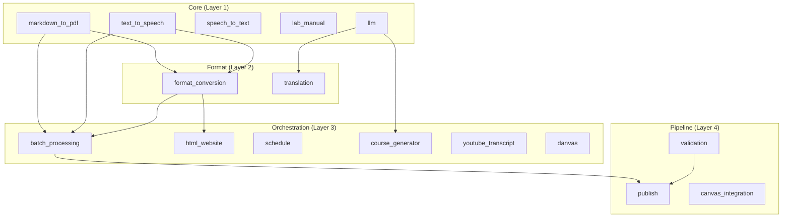

# Module Orchestration Guide

> **Navigation**: [← Quick Start](QUICKSTART.md) | [README](README.md) | [Architecture](ARCHITECTURE.md) | [Modules](MODULES.md) | [CLI Reference](CLI_REFERENCE.md)

This guide demonstrates how to combine multiple modules for complex workflows. Examples use `uv run` from `software/` (except the repo-root `publish.py`, which runs as plain `python` — it has no project root of its own) and reference Active Inference course paths.

---

## Composition Patterns

### 1. Independent Usage

Each module can run standalone:

```python
from src.markdown_to_pdf.main import render_markdown_to_pdf
from src.format_conversion.main import convert_file
from src.text_to_speech.main import generate_speech

# No dependencies between these calls
render_markdown_to_pdf("module.md", "module.pdf")
convert_file("module.md", "html", "module.html")
generate_speech("Active Inference minimizes free energy.", "lecture.mp3")
```

### 2. Conditional Composition

Process only modules that pass validation:

```python
from src.file_validation.main import validate_module_files
from src.batch_processing.main import process_module_by_type

validation = validate_module_files("/path/to/01_systems")
if validation["valid"]:
    process_module_by_type("/path/to/01_systems", "/path/to/01_systems/output")
```

### 3. Pipeline Composition

Chain modules in sequence for full course processing:

```python
from pathlib import Path
from src.batch_processing.main import process_module_by_type, process_syllabus
from src.batch_processing.utils import find_modules_for_course
from src.html_website.main import generate_module_website

course_path = Path("../course_development/active_inference/01_philosophy")

# Step 1: Process all modules
modules = find_modules_for_course(course_path, "ai-philosophy")
for module_path in modules:
    output_dir = module_path / "output"

    # Render all formats
    results = process_module_by_type(
        str(module_path), str(output_dir),
        formats=["pdf", "html", "txt", "md"]
    )
    print(f"{module_path.name}: {sum(results['summary'].values())} files")

    # Generate website
    generate_module_website(str(module_path), str(output_dir / "website"))

# Step 2: Process syllabus
syllabus = course_path / "syllabus.md"
if syllabus.exists():
    results = process_syllabus(str(syllabus.parent), str(course_path / "output"))
```

---

## Full Course Rendering Workflow

### CLI Approach (Recommended)

```bash
cd software

# Single course, all formats
uv run python scripts/generate_all_outputs.py --course ai-philosophy

# All courses, text only (fast)
uv run python scripts/generate_all_outputs.py --formats txt,md

# Preview first
uv run python scripts/generate_all_outputs.py --dry-run --course ai-math
```

### Programmatic Approach

```python
from src.batch_processing.utils import get_courses_to_process
from src.batch_processing.main import process_course_modules

# Process all registered courses
courses = get_courses_to_process("all")
for course_dir, course_name in courses:
    print(f"Processing {course_name}...")
    results = process_course_modules(
        course_dir, course_name, formats=["txt", "md", "html"]
    )
```

---

## Multi-Format Conversion Pipeline

Convert a single file to all formats:

```python
from src.markdown_to_pdf.main import render_markdown_to_pdf
from src.format_conversion.main import convert_file
from src.text_to_speech.main import generate_speech
from src.text_to_speech.utils import extract_text_from_markdown
from pathlib import Path

source = Path("../course_development/active_inference/01_philosophy/01_systems/module.md")
output = Path("output")
output.mkdir(exist_ok=True)
stem = source.stem

# Markdown → PDF
render_markdown_to_pdf(str(source), str(output / f"{stem}.pdf"))

# Markdown → HTML
convert_file(str(source), "html", str(output / f"{stem}.html"))

# Markdown → DOCX
convert_file(str(source), "docx", str(output / f"{stem}.docx"))

# Markdown → TXT
text = extract_text_from_markdown(str(source))
(output / f"{stem}.txt").write_text(text)

# Text → MP3
generate_speech(text, str(output / f"{stem}.mp3"))

# Markdown → MD (clean copy)
convert_file(str(source), "md", str(output / f"{stem}.md"))
```

---

## Schedule Processing Pipeline

```python
from src.schedule.main import process_schedule

results = process_schedule(
    "../course_development/active_inference/01_philosophy/syllabus.md",
    "output/syllabus",
    formats=["pdf", "html", "docx", "txt"]
)

print(f"Generated files:")
for fmt, count in results["summary"].items():
    print(f"  {fmt}: {count}")
```

---

## HTML Website Generation

Generate interactive module websites:

```bash
# Single module (module 1 by default)
uv run python scripts/generate_module_website.py --course ai-philosophy --module 1

# All modules for a course
uv run python scripts/generate_all_outputs.py --course ai-philosophy
```

Website features:

- 🗂️ Sidebar navigation
- 🎧 Embedded audio players
- ✅ Interactive quizzes
- 🌙 Dark mode toggle
- 📊 Progress tracking

---

## Publish Pipeline

### Using `publish.py` (from repo root)

```bash
# Full pipeline: generate + copy to published/
python publish.py

# Dry run
python publish.py --dry-run

# Override formats
python publish.py --override-formats pdf,html

# Single course
python publish.py --course ai-philosophy
```

### Using `publish_all.py` (from software/)

```bash
uv run python scripts/publish_all.py --clean --verbose
```

### Programmatic Usage

```python
from src.publish.main import publish_course
from src.validation.main import validate_published
from pathlib import Path

result = publish_course(
    course_path="/path/to/course_development/active_inference/01_philosophy",
    publish_root="/path/to/published"
)

# Validate output
validation = validate_published(Path("/path/to/published/ai-philosophy"))
print(f"Valid: {validation['valid']}, Files: {validation['total_files']}")
```

---

## Error Recovery Patterns

### Safe Processing

```python
def safe_process_module(module_path: str, output_dir: str) -> dict:
    """Process with error handling."""
    try:
        from src.batch_processing.main import process_module_by_type
        return {"success": True, "result": process_module_by_type(module_path, output_dir)}
    except ValueError as e:
        return {"success": False, "error": f"Invalid input: {e}"}
    except Exception as e:
        return {"success": False, "error": f"Unexpected error: {e}"}
```

### Validate-First Pattern

```python
def process_with_validation(module_path: str, output_dir: str) -> dict:
    """Always validate before processing."""
    from src.file_validation.main import validate_module_files

    validation = validate_module_files(module_path)
    if not validation["valid"]:
        return {"success": False, "validation": validation}

    from src.batch_processing.main import process_module_by_type
    return {"success": True, "result": process_module_by_type(module_path, output_dir)}
```

### Batch with Error Collection

```python
from src.batch_processing.utils import find_modules_for_course
from pathlib import Path

course_path = Path("../course_development/active_inference/01_philosophy")
modules = find_modules_for_course(course_path, "ai-philosophy")

results = {"passed": [], "failed": []}
for module in modules:
    result = safe_process_module(str(module), f"{module}/output")
    if result["success"]:
        results["passed"].append(module.name)
    else:
        results["failed"].append((module.name, result["error"]))

print(f"Passed: {len(results['passed'])}, Failed: {len(results['failed'])}")
```

---

## Module Dependency Graph



See [MODULES.md](MODULES.md) for the complete module API reference and [ARCHITECTURE.md](ARCHITECTURE.md) for the full layer diagram.

---

## Module Isolation Testing

```bash
# Test each module independently
uv run pytest tests/test_batch_processing_main.py -v
uv run pytest tests/test_publish_utils.py -v
uv run pytest tests/test_validation_main.py -v

# Run full suite
uv run pytest tests/ -v
```

---

*Last Updated: 2026-08-02*
